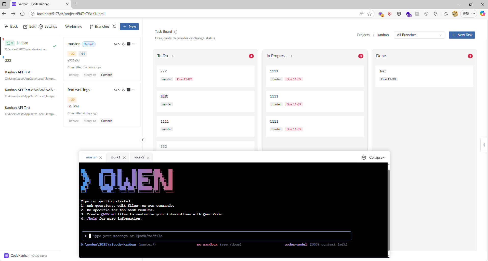

<div align="center">

# Code Kanban

An auxiliary programming tool for the AI era, helping you speed up 10x.




[English](README.en-US.md) | [简体中文](README.md)

[Core Features](#core-features) • [Development Guide](#development-guide) • [About](#about)

</div>

## Core Features

- **Ready to Use**: Single file, local database, double-click to use
- **Multi-Project Multi-Terminal Management**: Easily switch between 3-4 code repositories and dozens of terminals, each running different AI programming tasks
- **Git Worktree Management**: Lightweight branch management, let AI develop multiple features simultaneously, rollback anytime if unsatisfied
- **Task Kanban**: Visualize development task management with support for task status tracking and branch association
- **Web Terminal Integration**: Web terminal using the same technology stack as VSC, supports tab management, drag sorting, collapse/expand, etc. (Hotkey: `)
- **Notes Feature**: Supports multi-tab notes, auto-save, tabs can be renamed and sorted (Hotkey: 1)
- **Editor Integration**: Quick open VSCode, Cursor, Zed and other editors
- **Use Your Favorite Tools**: Claude Code, Codex, Gemini, Qwen Code, Droid, ... anything works

## Development Guide

### Requirements
- **Node.js**: v20.19.0+ or v22.12.0+
- **Go**: 1.24.6+
- **Package Manager**: pnpm (recommended)

### Install Dependencies

**Frontend Dependencies**:
```bash
cd ui
pnpm install
```

**Backend Dependencies**:
```bash
go mod tidy
```

### Development Mode

**Frontend Development Server**:
```bash
cd ui
pnpm dev
```
Access at: `http://localhost:5173`

**Backend Development Server**:
```bash
go run . # Note: After first run, config.yaml will be generated with port 3007. Due to conflicts with the production version, they cannot run simultaneously. It's recommended to change to 3005. The following assumes it has been changed.
```
- Server Port: `http://localhost:3005`
- OpenAPI Documentation: `http://localhost:3005/docs`
- Health Check: `http://localhost:3005/api/v1/health`

**Optional Parameters**:
- `-m` or `--migrate`: Force database migration
- `-i` or `--install`: Install as system service
- `--uninstall`: Uninstall system service

### Production Build

**Full Build** (Recommended):
```bash
python build.py
```
This script will automatically complete the following steps:
1. Build frontend (`pnpm build`)
2. Copy frontend artifacts to `static/` directory
3. Build Go executable (with optimization)

**Manual Build**:
```bash
# Build frontend
cd ui && pnpm build

# Build backend
go build -ldflags="-s -w" -trimpath -o CodeKanban
```

**Build Artifacts**:
- Frontend: `ui/dist/` → `static/` (After moving to this directory, building the backend will automatically store it in the executable, achieving single-file launch)
- Backend: `CodeKanban.exe` (Windows) or `CodeKanban` (Linux/macOS)

### Access Application

**Development Environment**:
- Frontend Dev Server: `http://localhost:5173`
- Backend API: `http://localhost:3005`

**Production Environment**:
Run the built executable and access `http://localhost:3007`

## About

We are in an era that is both rapidly changing and extremely divided, and our work is the same.

This tool has genuinely improved my efficiency, but perhaps the improvement in efficiency will also reduce work demand, and the development of AI will eliminate this industry.

Anyway, I hope everyone enjoys using it.

If it helps you, you can give it a star or sponsor me a little.

### Possible Future Features
- Mobile support
- Code cleanup: For example, the frontend's src/api should all be auto-generated
- Completion reminder feature, such as playing a sound after AI is done to tell you it's finished.
- Idle terminal list / Terminal list awaiting interaction.
